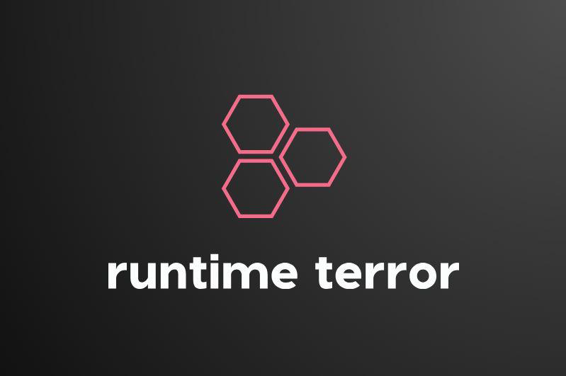

# Streamliner: The Ultimate FYP management System

The process of managing final year projects is a difficult one. Hundreds of students apply for their final year projects each year. This creates a lot of work for the management, the faculty and even the students themselves. The students need to request project supervisors for their projects, the faculty need to design and approve a list of projects, and the management needs to keep records of their progress. For now, this is done using older management software. There is a need to improve the existing system using new technologies which would allow the process to be streamlined.

## *Project Features*

1. Efficient Supervisor Allocation
2. Collaborative FYP Evaluation
3. Enhanced Understanding
4. Ratings on FYP by other panels
5. View FYP and comments from panel
6. View, add, edit and delete projects

###### Created by

